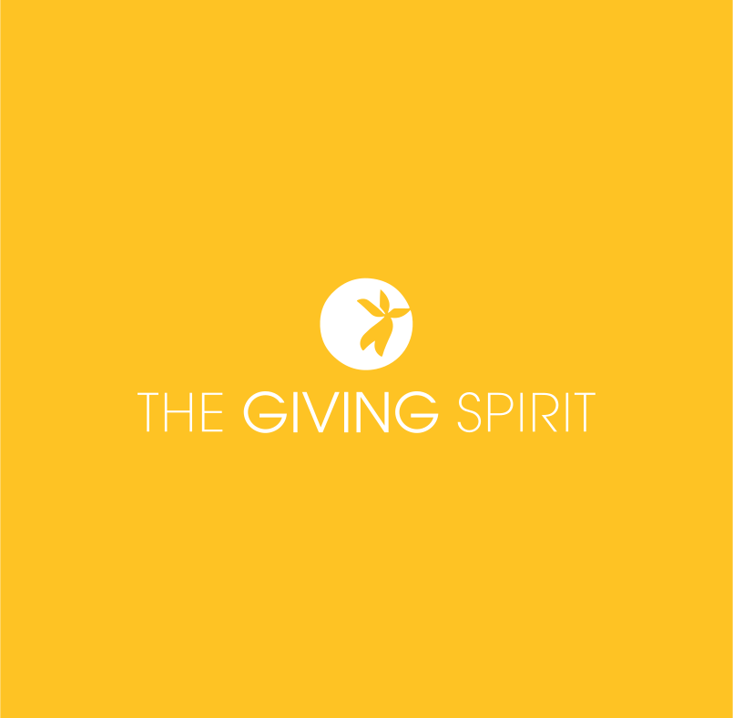
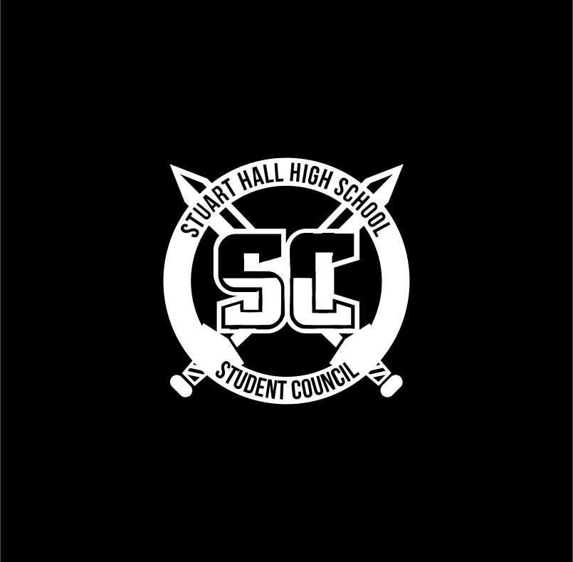

<html>
      <head>
        <meta charset="UTF-8">
        <title>Nick Hom</title>
      </head>
      <body>
        <html lang="en">
<head>
  <meta charset="utf-8">
  <title>Nick Hom</title>
  <meta name="description" content="the creative outlet">
  <meta name="author" content="Nicholas Hom">
  <meta name="viewport" content="width=device-width, initial-scale=1">
  <link rel="shortcut icon" href="img/favicon.ico">
  <link href="css/about.css" type='text/css' rel="stylesheet">
  <link href="https://fonts.googleapis.com/css?family=Open+Sans:300,400,600&display=swap" rel="stylesheet">
  <link href="https://fonts.googleapis.com/css?family=Ubuntu+Mono:400,700&display=swap" rel="stylesheet">

</head>

<body>
  

    

      <a href="#top">about</a>
      <a href="Resume.pdf">resume</a>
    

  

  

    

      
    

    
    

      <h1>Nice to meet you!</h1>
      
My name is Nicholas Hom, and I am a second-year undergraduate student at UCLA pursuing a degree in Economics with minors in Digital Humanities and Entrepreneurship.  If you have any questions, please find me at <a href="mailto:nickjhom@gmail.com">nickjhom@gmail.com</a>. Thanks!

       
      

        <a href="Resume.pdf">
view resume
</a>
      

    

  

  

    <h2>About Me</h2>
    

  

  

    

      

        <h3>Statistics</h3>
        <ul>
          <li><b>Born and raised:</b> San Francisco, CA</li>
          <li><b>Age:</b> 20</li>
          <li><b>Height:</b> Exactly 5'9"</li>
          <li><b>Personality Type:</b> INTP</li>
          <li><b>Favorite Color:</b> 
Blue
</li>
          <li><b>Favorite TV Show:</b> <i>The League</i></li>
          <li><b>Favorite Movie:</b> <i>Arrival</i></li>
          <li><b>Bucket List #1:</b> Travel to France</li>
          <li><b>Favorite Clothing:</b> Levi's Jeans</li>
          <li><b>Books Read This Year:</b> 2</li>
          <li><b>Favorite Memory:</b> When the bear broke into the AirBnb</li>
        </ul>
      

      

        <h3>Passions</h3>
        <ul>
          <li>Playing golf with friends</li>
          <li>Rooting for the San Francisco Giants</li>
          <li>Reading Michael Lewis books</li>
          <li>Winning in fantasy football</li>
          <li>Designing cool logos</li>
          <li>Learning the acoustic guitar</li>
          <li>Listening to Maroon 5</li>
          <li>Watching British panel shows</li>
          <li>Driving Herbie the Love Bug</li>
        </ul>
      

      

        <h3>Skills</h3>
        <ul>
          <li>Tableau</li>
          <li>Microsoft PowerPoint</li>
          <li>Microsoft Excel</li>
          <li>Microsoft Word</li>
          <li>C++</li>
          <li>R</li>
          <li>SQL</li>
          <li>Google Analytics</li>
          <li>HTML/CSS</li>
          <li>JavaScript</li>
          <li>Adobe Creative Suite</li>
          <li>French</li>
        </ul>
      

    

  

  

    <h2>Education</h2>
    

  

  

    

      

        
      

      

        <h3>University of California, Los Angeles
B.A. in Economics &amp; Minors in Digital Humanities and Entrepreneurship

Class of 2022
</h3>

        
I chose to attend UCLA for its finance-driven Economics degree, its fair weather, and urban location. While my studies thus far have focused on understanding micro and macro economic patterns, I have supplemented my major with extra classes in statistics and programming. I hope that my Economics degree will provide my with a strong quantitative foundation, while the Entrepreneurship and Digital Humanities minors will fully flush out my knowledge of business operations and of emerging technologies. UCLA has offered me the &quot;big school experience&quot; that I had been looking for, allowing me to explore activities, experiences, and types of people absent from my private education.

      

    

    

      

        
      

      

        <h3>Stuart Hall High School
International Baccalaureate Diploma  |  Sacred Heart Scholar

Class of 2018
</h3>
        
The unexpected opportunities that this school offered me, and those that I created myself, have shaped my intellectual and career-oriented interests to this day. Through my editorship of the school&#39;s student publication, it ingrained in me a sense of innovation and a chance at large-scale leadership. From the small-but-spirited community, I was able to find others who shared entrepreneurial visions and build my own company, and through the institution, I was able to take a risk in enrolling in the inaugural International Baccalaureate class, which eventually established my enthousiasm for economics.

      

    

  

  

    <h2>Work Experience</h2>
    

  

    

      

        

        
        

        

          <h3>Profitable Good Group
Consulting Associate

Sep 2019 - Present
</h3>
          
Profitable Good Group (PGG) is a boutique consulting firm based in Santa Monica, CA. Throughout my time at PGG, I had to pleasure of working with growing companies in identifying and leveraging profitable Shared Values strategies while increasing opportunities for revenue growth and social impact. My first experience at a consulting firm, I learned so much about the industry, the world of business, and the importance of establishing meaningful connections across the professional space from Managing Director Tom Bagamane.

        

      

      

        

          
        

        

          <h3>The Giving Spirit
Nonprofit Development Intern

Sep 2019 - Present
</h3>
          
The Giving Spirit is a nonprofit organization dedicated to providing aid to Los Angeles&#39; homeless community through the regular distribution of care packages. Because the organization was run like any other company, I had the opportunity to work with their strategic arm in producing detailed plans for spurring an increase in donations to be able to fund new strategic endeavors. Each extra dollar we created translated to another life touched, thus I understood the importance of my work and how my work ethic was directly reflected on the lives of others. 

        

      

      

        

          
        

        

          <h3>Zenfolio
Marketing Insights Intern

Jun 2019 - Sep 2019
</h3>
          
At Zenfolio, I was allocated multiple high-level tasks by the CMO to address throughout the summer: <b>1.</b> Look into the general practices of the marketing department, and provide recommendations on viable improvements, <b>2. </b> Perform SEO to improve web traffic flows, and <b>3. </b>Provide valuable data and resources for a go-to-market strategy. Given free reign on how to approach these goals, I went about consolidating and automating the company&#39;s internal data-collection processes to make my job easier. I was then able to produce weekly reports and recommendations on SEO and new features.

        

      

      

        

          
        

        

          <h3>UCSF Airway Clinical Research Center
Research Assistant

Jun 2018 - Sep 2018
</h3>
          
After graduating high school, I worked under Dr. John Fahy in improving the flow of study operations for both the participants and the researchers. Most of my time was spent entering and auditing information into Excel spreadsheets, but I was also able to do some cool things in the lab itself, like transferring frozen saliva samples from liquid nitrogen tanks.

        

      

      

        

          
        

        

          <h3>Visual Fanatic
Founding Member

Nov 2016 - Aug 2017
</h3>
          
I created Visual Fanatic with a few of my high school friends to understand so that we could understand what it would be like to be entrepreneurs. Our objective was to create a social media presence based off statistics from professional sports leagues and to act as vessel on which affiliates could sponsor content. Being the only person with any design experience, I initially took over the task of educating each member on the features of creative tools like Adobe Photoshop and Illustrator. Eventually, with enough knowledge of the company&#39;s operations, we were able to reach out to startups around the Bay Area for sponsorship opportunities.

        

      

    

  

    <h2>Club Involvement</h2>
    

  

  

    

      

          
      

      

          <h3>Creative Labs
Product Designer

Jan 2020 - Present
</h3>
        
Having focused much of the first year-and-a-half at UCLA on professional development and involvement in business clubs, I decided to apply to Creative Labs to further explore my creative side. I am currently the main Product Designer for Project fLOW, which aims to create a network of devices throughout UCLA&#39;s residential halls to measure overall water usage by students. As part of UCLA&#39;s Sustainable LA vision, we want to make students aware of their physical and virtual water footprints in the pursuit of a globally conscious society.

      

    

    

      

          
      

      

          <h3>UConsulting
Analyst &amp; Webmaster

Apr 2019 - Present
</h3>
        
In the spring quarter of my freshman year, I was accepted into the 10-person intern class (250+ applicants, ~4% acceptance rate) for UCLA&#39;s premier undergraduate consulting organization. UConsulting has given me the opportunity to work on a variety of cases both internally and with clients involving growth, pricing, and market entry strategies.

      

    

    

      

          
      

      

          <h3>International Business Fraternity of Delta Sigma Pi
Director of Marketing

Oct 2018 - Present
</h3>
        
In an effort to find a small group of focused, yet social, individuals at the large institution that is UCLA, I rushed and was extended a bid (160+ applicants, ~8% acceptance rate) to the coed business fraternity. Through this organization, I not only found my closest friends, but a network of mentors and mentees who have helped me navigate the academic and professional scenes at UCLA. While I came into the school naive to the world of business, through the fraternity&#39;s internal workshops and projects, I have been able to experiement further in analyzing financial statements, pitching stocks, producing business plans, and developing marketing campaigns.

      

    

    

      

          
      

      

          <h3>UCLA Club Golf
Social Chair

Oct 2018 - Present
</h3>
        
As a lifetime golfer, Club Golf has provided me with a competitive outlet to continue my passion for the game throughout college. Thus far, I have competed in 5 tournaments around the SoCal area, placing 3rd at the NCCGA&#39;s Winter 2018 tournament. As social chair, my tasks have extended from maintaining our close-knit community through regular social events to the procurement of funding for tournament travel.

      

    

    

      

          
      

      

          <h3>The Roundtable
Editor-in-Chief

Aug 2014 - May 2018
</h3>
        
My primary focus throughout high school, I joined the small club my freshman year and served as the lead editor for the next three. Initially, the publication was a quarterly magazine that was mostly unread by the school community. Beginning my second year, I recreated the publication in its modern broadsheet and online forms. Because we lacked personnel to produce weekly issues, we tried to only write on events most impactful to our school and city communities. This publication became my baby, and I worked tirelessly to massively improve its readership and recognition as a valuable resource to the school. In my senior year, we submitted our body of work to the national association presiding over the country&#39;s scholastic publications and was awarded <b>2nd Place Best in Show</b> out of 212 contestants. I still consider this my greatest achievement, for it showed me what I was truly capable of given my full time and effort.

      

    

<!--  

      

          
      

      

          <h3>SHHS Student Council
Director of Finance

Aug 2014 - May 2018
</h3>
        
I chose to attend 

      

    
 -->
  

  

    <h2>Graphic Design Work</h2>
    

  

  

    

      

        
        

          

            UConsulting

          

          

            <a href="https://uconsulting.club">
Go to site
</a>
          

        

      

    

    

      

        
        

          

            Visual Fanatic

          

          

            <a href="https://www.instagram.com/visual_fanatic/">
Go to Project
</a>
          

        

      

    

    

      

        
        

          

            Stuart Hall HS

          

          

            <a href="ArtPortfolio.pdf">
Go to Project
</a>
          

        

      

    

    

      

        
        

          

            Snapchat

          

          

            <a href="geos.pdf">
Go to Project
</a>
          

        

      

    

    

      

        
        

          

            The Roundtable

          

          

            <a href="https://issuu.com/shhs_roundtable">
Go to Project
</a>
          

        

      

    

    

      

        
        

          

            UCLA Delta Sigma Pi

          

          

            <a href="dspflyers.pdf">
Go to Project
</a>
          

        

      

    

    

</body>
</html>
